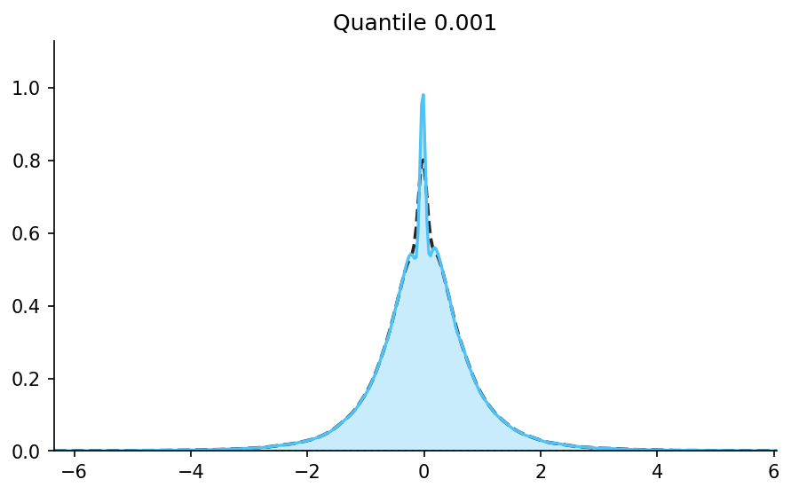
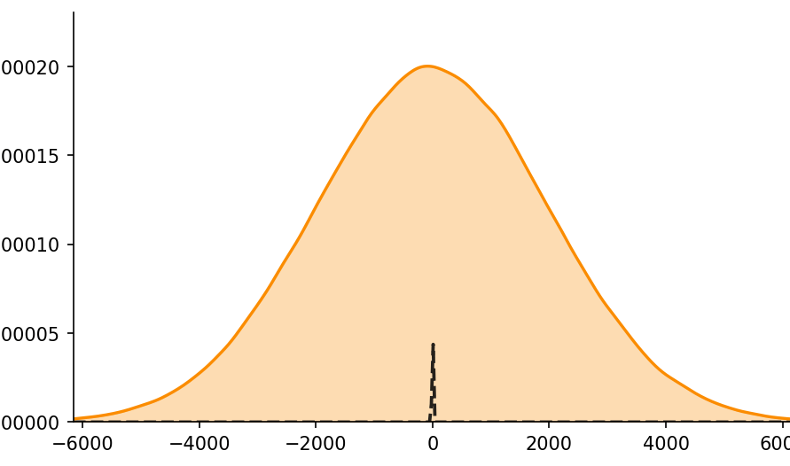
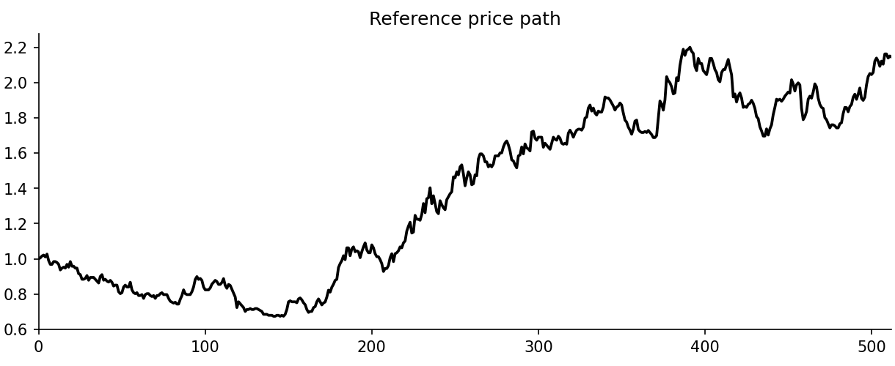
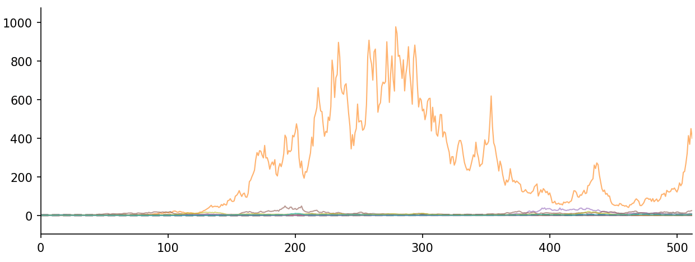
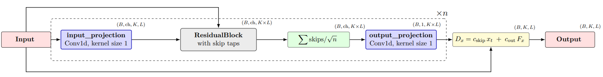
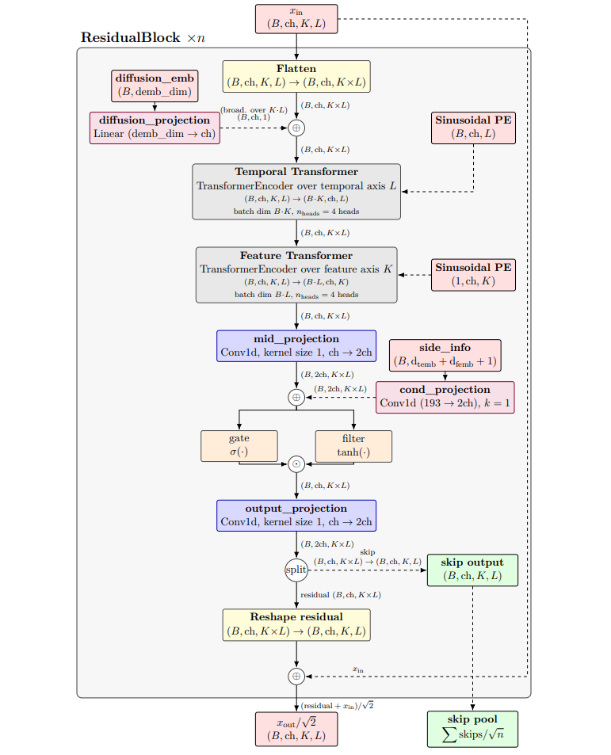
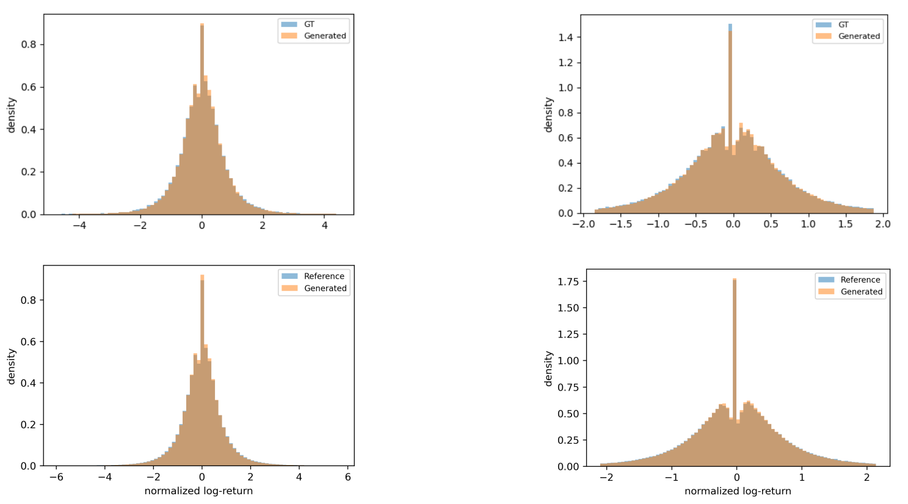
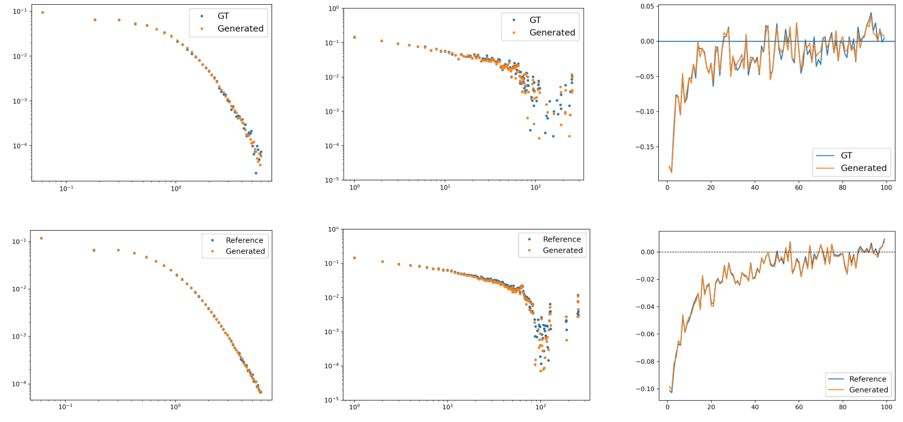
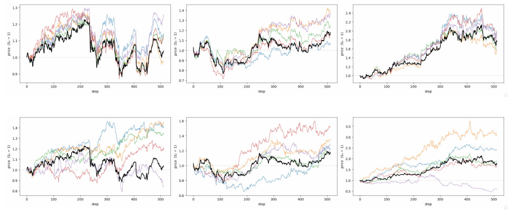

# EDM-CSDI for Financial Time Series

Diffusion-based generation of financial time series using a CSDI Transformer backbone, score-based stochastic differential equations, and the Elucidated Diffusion Model framework.

The project studies whether diffusion models can reproduce the distributional properties and stylized facts of daily S&P 500 log-returns, including:

- heavy-tailed return distributions;
- volatility clustering;
- the leverage effect;
- asymmetric and extreme market movements.

The research is divided into two phases:

1. **Phase 1 — Replication:** implementation and evaluation of VE, VP, and GBM-inspired score-based diffusion processes.
2. **Phase 2 — EDM-CSDI:** integration of the CSDI backbone into the EDM framework, followed by conditional generation of Close log-returns from same-day Open, High, and Low information.

<!-- Replace the paths below with the actual GIF locations -->

<table align="center">
  <tr>
    <td align="center">
      
      <br />
      <strong>Noising of FTS.</strong>
    </td>
    <td align="center">
      
      <br />
      <strong>Denoising of FTS.</strong>
    </td>
  </tr>
  <tr>
    <td align="center">
      
      <br />
      <strong>Noising a single price path.</strong>
    </td>
    <td align="center">
      
      <br />
      <strong>Denoising a single price path.</strong>
    </td>
  </tr>
</table>

## Repository Navigation

The implementations associated with the two research phases are maintained in separate branches:

| Branch | Purpose |
|---|---|
| [`baselines`](https://github.com/GiacomoNegri/Master-Thesis/tree/baselines) | Baseline models: GARCH-X and Merton-X |
| [`phase1`](https://github.com/GiacomoNegri/Master-Thesis/tree/phase1) | Replication experiments using VE, VP, and sub-VP SDEs |
| [`phase1_gbm`](https://github.com/GiacomoNegri/Master-Thesis/tree/phase1_gbm) | Replication experiments using GBM-inspired SDEs |
| [`phase2_edm`](https://github.com/GiacomoNegri/Master-Thesis/tree/phase2_edm) | Unconditional and OHL-conditioned EDM-CSDI experiments |
| [`future_work`](https://github.com/GiacomoNegri/Master-Thesis/tree/future_work) | Extensions of `phase2_edm` using different architecture settings and sampling techniques |
| [`visualizations`](https://github.com/GiacomoNegri/Master-Thesis/tree/visualizations) | Visualization scripts for the thesis and final presentation |

## Abstract
Modeling financial time series (FTS) remains a central challenge in Quantitative Finance, since returns exhibit stylized facts such as heavy tails, volatility clustering, and the leverage effect that break the assumptions of classical models. While score-based diffusion models have reached state-of-the-art generation in other domains, their application to FTS is still limited. This thesis investigates whether diffusion models can learn the distributional properties of S&P 500 log-returns and reproduce their core stylized facts. 

The work is structured in two sequential phases. Phase 1 replicates the approach of Kim et al., implementing VE, VP, and GBM-inspired SDE variants on univariate Close log-returns to establish a validated baseline and to expose the design ambiguities present in the original paper. Phase 2 embeds a Conditional Score-based Diffusion (CSDI) backbone within the Elucidated Diffusion Model (EDM) framework of Karras et al., yielding the EDM-CSDI model, and introduces multivariate conditioning, learning to generate Close log-returns given the contemporaneous Open, High, and Low observations. Models are evaluated against GARCH-X and Merton-X parametric baselines using distributional similarity measures (KS test, Wasserstein-1 distance, tail exponent α), probabilistic forecasting measures (CRPS and interval coverage), and an assessment of the stylized facts. 

The results show that the CSDI-based architecture learns the bulk of the FTS distribution under the SDE framework but consistently underestimates higher moments, while the GBM family in its current formulation fails outright. The parametric and diffusion baselines fail in opposite directions: GARCH-X and Merton-X overstate excess kurtosis by orders of magnitude, whereas unconditional diffusion reverts to an average volatility regime and understates it. Adding same-day Open, High, and Low conditioning to EDM-CSDI provides the missing regime signal: the excess-kurtosis deficit shrinks from 49% to 1% and W₁ improves roughly fivefold, with the gain concentrated in high-volatility windows, while conditioning yields a CRPS skill score of about 0.40 over an OLS baseline. More broadly, the work generalizes the design framework to enable easier replicability and a higher degree of control over training choices. 

## Full Thesis

The complete thesis is available here: [Read the full thesis](docs/Master_Thesis.pdf)

---

## Project Overview

Financial returns violate several assumptions commonly adopted by classical parametric models. Their distributions are asymmetric and heavy-tailed, their volatility changes over time, and negative returns are often followed by increased future volatility.

This project investigates whether score-based diffusion models can learn these properties directly from historical data without imposing a fixed parametric return distribution.

The proposed final model, **EDM-CSDI**, combines:

- the temporal and feature attention mechanisms of CSDI;
- the explicit training and preconditioning design of EDM;
- multivariate Open, High, Low, and Close log-return inputs;
- deterministic masking in which Open, High, and Low are observed while Close is generated;
- second-order Heun sampling.

<table align="center">
  <tr>
    <td align="center">
      
      <br />
      <strong>High-level overview of the CSDI denoising network. The two-channel input is projected into a latent space, processed by n stacked residual blocks with skip connections, and decoded back to the predicted clean signal.</strong>
    </td>
  </tr>

  <tr>
    <td align="center">
      
      <br />
      <strong>ResidualBlock architecture, CSDI–inspired. Each block emits a skip connection aggregated across all nlayers blocks.</strong>
    </td>
  </tr>
</table>
---

## Research Questions

### RQ1 — Phase 1: Replication

Can a CSDI-based diffusion architecture trained under the VE, VP, and GBM-inspired SDE families learn the distribution of S&P 500 Close log-returns and reproduce:

- heavy tails;
- volatility clustering;
- the leverage effect.

### RQ2 — Phase 2: EDM-CSDI

Does embedding the CSDI backbone within the EDM framework improve unconditional Close log-return generation over the Phase 1 SDE baseline?

Does conditioning the model on same-day Open, High, and Low log-returns further improve:

- distributional fidelity;
- tail behaviour;
- higher-order moments;
- probabilistic forecast sharpness.

---

## Main Contributions

### CSDI and EDM integration

The CSDI Transformer architecture is reformulated inside the EDM framework, separating the main diffusion design choices:

- noise-level distribution;
- network preconditioning;
- prediction target;
- loss weighting;
- sampling schedule;
- numerical solver.

### Conditional financial generation

The model learns the conditional distribution

$$
p(C_t \mid O_t, H_t, L_t),
$$

where all four OHLC channels are represented as log-returns relative to the previous Close.

### Comprehensive evaluation

Generated samples are evaluated using:

- Kolmogorov–Smirnov distance;
- Wasserstein-1 distance;
- aggregate distributional statistics;
- skewness and excess kurtosis;
- power-law tail exponent;
- volatility-clustering autocorrelation;
- leverage-effect correlation;
- Continuous Ranked Probability Score;
- empirical prediction-interval coverage.

### Replication analysis

The implementation exposes several ambiguities in the original GBM-inspired diffusion formulation and evaluates the effects of:

- SDE family;
- noise schedule;
- prediction target;
- window length;
- conditioning;
- deterministic and stochastic sampling.

---

## Two-Phase Research Design

| Component | Phase 1 — Replication | Phase 2 — EDM-CSDI |
|---|---|---|
| Main objective | Replicate the VE, VP, and GBM-inspired models | Improve generation through EDM preconditioning and OHL conditioning |
| Target | Close log-returns | Close log-returns |
| Input channels | Close | Open, High, Low, Close |
| Number of channels | $K=1$ | $K=4$ |
| Conditioning | Unconditional: $m^{\mathrm{co}}=0$ | Open, High, and Low observed; Close masked |
| Sequence length | $L=2048$ | $L=512$ |
| Window stride | $s=400$ | $s=100$ |
| Forward process | SDE-dependent perturbation: $x_t=\mu_t(x_0)+\sigma_t\epsilon$ | VE-style perturbation: $x_\sigma=x_0+\sigma\epsilon$ |
| Prediction target | Injected noise: $`\widehat{\epsilon}_{\theta}=F_{\theta}(x_t,t)`$ | Clean sample: $`D_{\theta}(x_{\sigma};\sigma)\approx x_0`$ |
| Preconditioning | None: the raw network $F_\theta(x_t,t)$ directly predicts $\epsilon$ | $D_\theta(x;\sigma)=c_{\mathrm{skip}}x+c_{\mathrm{out}}F_\theta(c_{\mathrm{in}}x;c_{\mathrm{noise}})$ |
| Training noise | $t\sim\mathcal{U}(0,1)$ and $\epsilon\sim\mathcal{N}(0,I)$ | $\ln\sigma\sim\mathcal{N}(P_{\mathrm{mean}},P_{\mathrm{std}}^2)$ and $\epsilon\sim\mathcal{N}(0,I)$ |
| Noise parameters | VE: $\sigma_{\min}=0.01$, $\sigma_{\max}=1$; GBM: $\sigma_{\min}=0.1$, $\sigma_{\max}=10$; VP: $\beta_{\min}=0.01$, $\beta_{\max}=8$ | $P_{\mathrm{mean}}=-1.4$, $P_{\mathrm{std}}=1.8$, $\sigma_{\mathrm{data}}=1$ |
| Training objective | Denoising score matching: $\mathbb{E}\lVert\epsilon-F_\theta(x_t,t)\rVert_2^2$ | Weighted MMSE denoising: $\mathbb{E}\left[\lambda(\sigma)\lVert D_\theta(x_\sigma;\sigma)-x_0\rVert_2^2\right]$ |
| Main sampler | First-order probability-flow ODE | Second-order Heun probability-flow ODE |
| Sampling budget | 2,000 first-order discretization steps | 200 Heun steps, corresponding to approximately 400 NFEs |
| Sampler/training coupling | Coupled to the SDE and noise schedule used during training | Decoupled: compatible ODE or SDE solvers can be changed without retraining |

---

## Data

The experiments use daily adjusted OHLC observations from long-running S&P 500 constituents, particularly 210 tickers, each one with $\ge 40$ years of history.

For each trading day, the channels are transformed into log-returns relative to the preceding Close:

$$r_t^C = \log\left(\frac{C_t}{C_{t-1}}\right)$$

$$
r_t^O = \log\left(\frac{O_t}{C_{t-1}}\right), \qquad
r_t^H = \log\left(\frac{H_t}{C_{t-1}}\right), \qquad
r_t^L = \log\left(\frac{L_t}{C_{t-1}}\right).
$$

For Phase 2, each channel is independently standardized before training.

Sliding windows are used to transform the historical observations into model inputs:

- **Phase 1:** length 2048, stride 400;
- **Phase 2:** length 512, stride 100.

A strictly held-out set of windows is used for the conditional evaluation.

---

## Models

### Classical baselines

Two conditional parametric models are used as interpretable reference points:

- **GARCH-X:** volatility model with OHLC-derived exogenous variables;
- **Merton-X:** jump-diffusion model with OHLC-derived exogenous variables.

These models reproduce parts of the central distribution but fail to reproduce the complete combination of stylized facts. Their symmetric volatility specifications also prevent them from learning the leverage effect.

### Phase 1 diffusion models

Phase 1 evaluates combinations of:

#### SDE families

- Variance Exploding;
- Variance Preserving;
- GBM-inspired diffusion in log-price space.

#### Noise schedules

- linear;
- cosine;
- exponential.

All Phase 1 models use a CSDI-derived Transformer denoiser and predict the injected Gaussian noise.

### EDM-CSDI

Phase 2 retains the CSDI temporal and feature attention architecture but replaces the Phase 1 training formulation with EDM.

The denoiser is defined as

```math
D_{\theta}(x;\sigma)
=
c_{\mathrm{skip}}(\sigma)\,x
+
c_{\mathrm{out}}(\sigma)\,
F_{\theta}\!\left(
    c_{\mathrm{in}}(\sigma)\,x;
    c_{\mathrm{noise}}(\sigma)
\right)
```

The conditional model receives:

- clean Open, High, and Low observations;
- a noised Close target;
- a conditioning mask;
- temporal embeddings;
- feature embeddings;
- positional encodings;
- the current EDM noise level.

---

## Main Results

### RQ1 — Replication results

The Phase 1 experiments show that the CSDI-based architecture can learn the bulk of the return distribution and reproduce the main stylized facts at a reduced scale.

The strongest configurations are based on the VE family:

- **VE + Exponential** obtains the best overall distributional similarity;
- **VE + Cosine** performs similarly;
- **VP + Cosine** obtains one of the closest power-law tail exponents.

However:

- higher-order moments remain underestimated or unstable;
- the central zero-return spike is oversmoothed;
- volatility clustering and leverage effects are weaker than in the reference data;
- the GBM-inspired configurations produce approximately Gaussian samples and fail to reproduce the empirical tails.

Therefore, RQ1 is answered **partially positively**: the architecture learns meaningful financial structure, but the Phase 1 formulation does not fully recover the empirical distribution.

### RQ2 — EDM-CSDI results

EDM preconditioning alone does not produce a consistent improvement over the strongest Phase 1 models.

The decisive improvement comes from conditioning on Open, High, and Low log-returns.

| Model | Std. dev. | Skewness | Excess kurtosis | W1 ↓ | Tail exponent |
|---|---:|---:|---:|---:|---:|
| Reference | 1.0000 | -0.5864 | 39.5 | — | 4.418 |
| Phase 1 VE + Exponential | 0.952 | -0.2382 | 14.3 | 0.0019 | 4.634 |
| EDM-CSDI, unconditional | 0.7523 | -0.2292 | 20.0 | 0.0029 | 4.640 |
| **EDM-CSDI, conditional** | **0.9487** | **-0.5390** | **39.0** | **0.0006** | **4.572** |

The conditional model:

- reduces the excess-kurtosis deficit from approximately 49% to approximately 1%;
- improves Wasserstein distance by almost five times over unconditional EDM-CSDI;
- more accurately reproduces extreme quantiles;
- better distinguishes low- and high-volatility regimes;
- reproduces heavy tails, volatility clustering, and the leverage effect more faithfully;
- generates paths that respond visibly to the supplied OHL information.

<table align="center">
  <tr>
    <td align="center">
      
      <br />
      <strong>Marginal distribution against the empirical reference (blue) for the EDM-CSDI (Cond.) model. Top row: validation windows only (GT, because only windows used for
conditioning were considered); bottom row: validation and training windows combined.
Left column: full density range $q_{0.001}–q_{0.999}$; right column: central range $q_{0.02}–q_{0.98}$.</strong>
    </td>
  </tr>

  <tr>
    <td align="center">
      
      <br />
      <strong>Stylized facts with Reference or Ground Truth (GT) (blue) versus Generated for the EDM-CSDI (Cond.) model. Top row: validation windows only; first column: Validation windows versus the ground truth (conditioning windows). second column: combined validation and training windows versus the entire Reference (dataset). Left column: heavy-tail distribution; centre column: volatility clustering; right column: leverage
effect.</strong>
    </td>
  </tr>

  <tr>
    <td align="center">
      
      <br />
      <strong> Samples of prices paths. Top. EDM-CSDI (Con.). Bottom. EDM-CSDI (Unc.). In black is drawn the Ground Truth, identical for both models.</strong>
    </td>
  </tr>
</table>
---

## Probabilistic Forecasting Results

The conditional model is also evaluated as a probabilistic predictor of Close log-returns.

Using 50 generated samples for each conditioning window:

| Model | MAE ↓ | CRPS ↓ |
|---|---:|---:|
| Climatology | 0.65065 | 0.48235 |
| OLS with OHL predictors | 0.28520 | 0.21255 |
| **EDM-CSDI conditional** | **0.19379** | **0.12659** |

This corresponds to a CRPS skill score of approximately:

- **73.76% over climatology**;
- **40.44% over the OLS baseline**.

The model is reasonably calibrated at moderate confidence levels but remains overconfident in the extremes:

| Nominal interval | Empirical coverage |
|---:|---:|
| 50% | 53.05% |
| 80% | 82.52% |
| 90% | 90.50% |
| 95% | 94.02% |
| 99% | 96.84% |

The remaining upper-tail miscalibration is important for risk-sensitive applications and represents one of the main limitations of the final model.

---

## Stylized Facts

The three primary stylized facts are evaluated directly.

### Heavy tails

The empirical power-law exponent is approximately \(4.42\). The conditional model estimates an exponent of approximately \(4.57\), substantially closer to the reference than the failed GBM-inspired Phase 1 configurations.

### Volatility clustering

The conditional model reproduces the slowly decaying autocorrelation of absolute returns more accurately than the unconditional models.

OHL conditioning is especially valuable because it communicates the current volatility regime to the denoiser.

### Leverage effect

The conditional model captures the negative relationship between past returns and future volatility more clearly than the classical baselines and the unconditional diffusion configurations.

<p align="center">
  <em>Figure placeholder — heavy tails, volatility clustering, and leverage effect</em>
</p>

<!-- Replace the placeholder above with:

<p align="center">
  
</p>

-->

---

## Additional Experiments

The thesis also investigates the following design choices.

### Stochastic sampling

Introducing stochastic churn improves variance and Wasserstein distance but can overshoot skewness and kurtosis by moving samples into poorly learned regions.

### Number of function evaluations

Heun sampling with 200, 400, and 600 network evaluations produces very similar aggregate results. The default budget of 400 evaluations is therefore not a binding constraint.

### Volatility-regime analysis

Conditional EDM-CSDI reproduces the difference between high- and low-volatility windows more accurately than the unconditional model.

This supports the interpretation that Open, High, and Low provide a useful volatility-regime signal.

### Capacity ablation

Reducing the model from approximately 3.4 million to 1.2 million parameters preserves much of the distributional performance but weakens skewness, tail stability, and probabilistic accuracy.

The smaller model appears to underfit rather than reveal evidence of memorization.

---

## Limitations

The main limitations are:

- experiments are restricted to S&P 500 constituents;
- OHL conditioning and the EDM reformulation are not fully isolated in a complete factorial experiment;
- the central zero-return spike is not perfectly reconstructed;
- extreme prediction intervals remain overconfident;
- stochastic sampling parameters are not exhaustively tuned;
- hard OHLC constraints such as \(H \geq C \geq L\) are not enforced;
- evaluation focuses mainly on statistical fidelity rather than downstream financial decisions;
- computational constraints limit the number of generated ensembles and ablations.

---

## Future Work

Promising extensions include:

- systematic stochastic-churn optimization;
- constraint-preserving OHLC generation;
- regime-balanced or tail-weighted training;
- learnable positional encodings;
- alternative prediction targets and preconditioning combinations;
- testing on other indices, asset classes, and market regimes;
- evaluation through Value at Risk and Expected Shortfall;
- option-pricing and stress-testing applications;
- multistep forecasting beyond same-day OHL conditioning;
- joint generation of all OHLC channels;
- explicit modeling of jumps and rare market events.

---

## Key References

1. G. Kim, S.-Y. Choi, and Y. Kim.  
   *A Diffusion-Based Generative Model for Financial Time Series via Geometric Brownian Motion*, 2025.  
   [arXiv:2507.19003](https://arxiv.org/abs/2507.19003)

2. T. Karras, M. Aittala, T. Aila, and S. Laine.  
   *Elucidating the Design Space of Diffusion-Based Generative Models*, 2022.  
   [arXiv:2206.00364](https://arxiv.org/abs/2206.00364)

3. Y. Tashiro, J. Song, Y. Song, and S. Ermon.  
   *CSDI: Conditional Score-Based Diffusion Models for Probabilistic Time Series Imputation*, 2021.  
   [arXiv:2107.03502](https://arxiv.org/abs/2107.03502)
